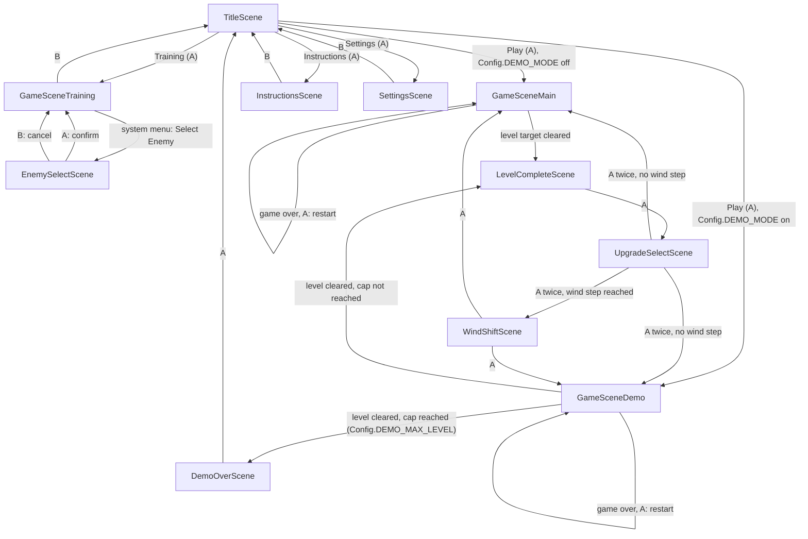

# Scenes

One page per `NobleScene` subclass in this folder: what it's for, how you get
there, what it does with the buttons, and where it sends you next. Keep this
file in sync when you add, remove, or rewire a scene — see the note in the
repo's top-level `CLAUDE.md`.

All scenes are reached via `Noble.transition(SomeScene, ..., sceneProperties)`
(Noble Engine, `source/libraries/noble/Noble.lua`). `sceneProperties` is the
table passed to the new scene's `:init()` — each section below lists what
keys a scene reads out of it, if any.

## Flow diagram

`GameMain`/`GameDemo`'s edges into `LevelComplete`/out of `UpgradeSelect`/`WindShift` all carry a `gameScene` sceneProperty (the class to eventually return to — `GameSceneMain.gameSceneClass`, see `GameSceneMain`/`GameSceneDemo` below) that those three interstitial scenes just forward along without needing to know which one it is — that's what lets the same chain serve both.

Functional coverage of every edge in this diagram (driven by simulated
button-down events, not the real Simulator) lives in
[`tests/test_scene_flow.lua`](../../tests/test_scene_flow.lua) — see that
file's header and `tests/support/mock_game_scene.lua` for what's real vs.
stubbed.

## TitleScene

Start screen — the game's entry point (`main.lua` calls
`Noble.new(TitleScene, ...)`). Renders a 4-item menu with
[playout](../libraries/playout.lua).

- **Reached from:** app launch only.
- **Controls:** Up/Down move the highlight (wraps); A confirms.
- **Menu items → transitions:**
  - "Play" → `GameSceneMain` (or `GameSceneDemo`, if `Config.DEMO_MODE` is on)
  - "Training" → `GameSceneTraining`
  - "Instructions" → `InstructionsScene`
  - "Settings" → `SettingsScene`
- **sceneProperties read:** none.

## GameSceneMain

The real game. Enemies spawn automatically on a shrinking timer, capped per
level (`Config.LEVEL_ENEMY_STEP` enemies per level N). Clearing a level's
kill target calls `self:onLevelComplete()`; every wind-escalation step
(`Config.LEVEL_WIND_STEP_INTERVAL` levels) routes the *next* level through
`WindShiftScene` first instead of coming straight back here (see
`GameSceneMain.windStepForLevel`).

`GameSceneMain.gameSceneClass` (class-level, defaults to `GameSceneMain`
itself) is what the shared `AButtonDown` restart handler and
`onLevelComplete`/the `LevelCompleteScene`→`UpgradeSelectScene`→
`WindShiftScene` chain actually transition back to, instead of hardcoding
`GameSceneMain` — see `GameSceneDemo` below, the one other class that sets
this to something else.

- **Reached from:** `TitleScene` ("Play", no properties — starts at level 1),
  `UpgradeSelectScene` or `WindShiftScene` (continuing a run).
- **Controls:** crank steers, Up/Down trim sail, Left/Right charge+release a
  broadside (shared with `GameSceneTraining` via `GameScene.buildSharedInputHandler`).
  A restarts the run *from level 1* once `gameOver` is true — otherwise A does
  nothing (this isn't a pause/resume, it's a full restart).
- **sceneProperties read:** `level` (default 1), `totalDefeated` (default 0,
  becomes `self.score`).
- **Transitions out:**
  - Level's kill target reached → `self:onLevelComplete()` →
    `Noble.transition(LevelCompleteScene, ..., { completedLevel, totalDefeated, gameScene = self.gameSceneClass })`
  - `gameOver` and A pressed → `Noble.transition(self.gameSceneClass)` (fresh run)

## GameSceneDemo

A level-capped variant of `GameSceneMain` for a trade-show/kiosk build:
extends `GameSceneMain` directly and inherits everything (spawning, level
progression, wind tuning, upgrade-select flow, shared input handler) except
`onLevelComplete`, which it overrides to end the run via `DemoOverScene`
instead of continuing to the next level once `self.level >=
Config.DEMO_MAX_LEVEL`. `GameSceneDemo.gameSceneClass = GameSceneDemo`
(see `GameSceneMain.gameSceneClass` above) is the only other thing it sets —
that alone is what keeps a mid-run restart or an upgrade-select "continue"
landing back on `GameSceneDemo` instead of the uncapped `GameSceneMain`.

- **Reached from:** `TitleScene` ("Play", only when `Config.DEMO_MODE` is
  true), `UpgradeSelectScene` or `WindShiftScene` (continuing a run below the
  cap).
- **Controls:** identical to `GameSceneMain` (inherited, not redeclared).
- **sceneProperties read:** same as `GameSceneMain` (inherited `resetGame`).
- **Transitions out:**
  - Level's kill target reached, `self.level < Config.DEMO_MAX_LEVEL` →
    same as `GameSceneMain`, with `gameScene = GameSceneDemo`.
  - Level's kill target reached, `self.level >= Config.DEMO_MAX_LEVEL` →
    `Noble.transition(DemoOverScene, ..., { completedLevel, totalDefeated })`.
  - `gameOver` and A pressed → `Noble.transition(GameSceneDemo)` (fresh run).

## DemoOverScene

Shown once `GameSceneDemo` reaches its level cap — reports levels cleared
and enemies defeated, then returns to `TitleScene`. Only reachable in a
`Config.DEMO_MODE` build.

- **Reached from:** `GameSceneDemo` (level cap reached).
- **Controls:** A returns to `TitleScene`.
- **sceneProperties read:** `completedLevel` (default 1), `totalDefeated`
  (default 0).
- **Transitions out:** A → `Noble.transition(TitleScene)`.

## GameSceneTraining

A sandbox for testing ship/wind/combat feel: no automatic spawning or level
progression. Adds a "Select Enemy" item to the system menu while active (see
the 3-item system-menu cap note in the repo's `CLAUDE.md` before adding
another system-menu item anywhere).

- **Reached from:** `TitleScene` ("Training"), `EnemySelectScene` (after
  confirming or cancelling a pick).
- **Controls:** shared steer/trim/charge bindings (see `GameSceneMain` above);
  A spawns one enemy (`GameSceneTraining.selectedEnemyType`, or random if unset);
  B returns to `TitleScene`.
- **sceneProperties read:** none.
- **Transitions out:**
  - B → `Noble.transition(TitleScene)`
  - System menu "Select Enemy" → `Noble.transition(EnemySelectScene)`
- **Notable state:** `GameSceneTraining.selectedEnemyType` is a *class-level*
  field (not per-instance), so it survives this scene being torn down and
  recreated — that's how `EnemySelectScene`'s pick sticks across a
  transition back into a brand-new `GameSceneTraining` instance.

## EnemySelectScene

Reached only from `GameSceneTraining`'s system-menu item. Lists every entry in
`GameScene.enemyTypes` so you can force a specific type instead of a random
one.

- **Reached from:** `GameSceneTraining` (system menu "Select Enemy").
- **Controls:** Up/Down move the highlight (wraps, defaults to whatever
  `GameSceneTraining.selectedEnemyType` currently is); A confirms and returns; B
  cancels and returns without changing the selection.
- **sceneProperties read:** none (reads `GameSceneTraining.selectedEnemyType`
  directly).
- **Transitions out:** A or B → `Noble.transition(GameSceneTraining)` (A also
  sets `GameSceneTraining.selectedEnemyType` first).

## InstructionsScene

Extends `GameScene` (like `GameSceneMain`/`GameSceneTraining`) instead of
`NobleScene` directly, so the player's own ship is really sailing on real
water while they work through a step-by-step walkthrough, drawn above the
ship (which, like every `GameScene`, sits camera-locked at screen center) so
the water, wake, and practice target stay visible underneath. Every control
has two directions, and each direction gets its own step (crank one way, then
the other; Up, then Down; Left broadside, then Right), so the player actually
exercises both instead of just whichever's more convenient. Each step only
clears once the player actually performs *that* direction enough — see
`Config.INSTRUCTIONS_*`:
- Crank steps: `INSTRUCTIONS_CRANK_SECONDS` of cumulative time spent actively
  cranking that sign of delta (no discrete "press" to count, see
  `InstructionsScene:onCranked`).
- Up/Down steps: `INSTRUCTIONS_TRIM_PRESSES` presses of that specific button.
- Left/Right steps: `INSTRUCTIONS_BROADSIDE_PRESSES` scored hits with that
  specific button — a press only counts if `pickTarget` finds an in-range
  target (see `InstructionsScene:onBroadsideButtonDown`), not just any press.
  A stationary, harmless `EnemyDummy` (can't move, ram damage is 0) spawns on
  the side the current step is teaching, at `INSTRUCTIONS_DUMMY_DISTANCE`; if
  destroyed, a fresh one immediately takes its place (see
  `InstructionsScene:tickGame`/`spawnDummyTarget`) so there's always
  something to aim the button being taught at. If that target stays out of
  range for `INSTRUCTIONS_OUT_OF_RANGE_HINT_SECONDS` (tracked continuously in
  `tickGame`, default 5s), the hint text escalates from "get closer" to
  pointing at the target's off-screen indicator, which starts flashing (see
  `InstructionsScene:shouldFlashOffscreenIndicator`, overriding
  `GameScene`'s default rule of flashing whenever only one enemy is left).

- **Reached from:** `TitleScene` ("Instructions").
- **Controls:** real `GameScene` ship controls throughout (crank steers,
  Up/Down trims, Left/Right charges/fires a broadside) via
  `GameScene.buildSharedInputHandler`, wrapped to also track step progress; B
  returns to `TitleScene` at any point, regardless of step.
- **sceneProperties read:** none.

## SettingsScene

Toggles the `Config.HUD_SHOW_*` flags (Wind Speed / Wind Direction / Player
Speed) — moved here (out of the system menu) so the system menu stays free
for scene-specific items like `GameSceneTraining`'s "Select Enemy"; see the
3-item cap note in `CLAUDE.md`. Built with
[playout](../libraries/playout.lua).

- **Reached from:** `TitleScene` ("Settings").
- **Controls:** Up/Down move the highlight (wraps); A toggles the
  highlighted setting; B returns to `TitleScene`.
- **sceneProperties read:** none.

## LevelCompleteScene

Interstitial shown after clearing a level (below the demo cap, if any):
reports the running defeated total, then hands off to `UpgradeSelectScene`
to pick a run upgrade before continuing. Just forwards `gameScene` along
without needing to know what it is — see `GameSceneMain.gameSceneClass`.

- **Reached from:** `GameSceneMain`/`GameSceneDemo` (level target cleared,
  via `onLevelComplete`).
- **Controls:** A continues.
- **sceneProperties read:** `completedLevel` (default 1), `totalDefeated`
  (default 0), `gameScene` (default `GameSceneMain`).
- **Transitions out:** A → `Noble.transition(UpgradeSelectScene, ..., { level = completedLevel + 1, completedLevel, totalDefeated, gameScene })`.

## UpgradeSelectScene

Offers 3 randomly-drawn entries from `Config.UPGRADES`
(`source/scripts/ConfigUpgrades.lua`), rendered with
[playout](../libraries/playout.lua). Two phases: `"select"` (pick one) then
`"result"` (before/after readout), each its own screen behind the same A
button. Carries the level/wind-step/gameScene handoff the rest of the way —
decides whether the run continues straight back into `self.gameScene` or
detours through `WindShiftScene` first.

- **Reached from:** `LevelCompleteScene`.
- **Controls:** Up/Down move the highlight (`"select"` phase only); A
  applies the highlighted upgrade (via `Config.applyUpgrade`) and swaps to
  the result screen; a second A continues on.
- **sceneProperties read:** `level` (default 1), `completedLevel` (default
  `level - 1`), `totalDefeated` (default 0), `gameScene` (default
  `GameSceneMain`).
- **Transitions out (second A press, from `"result"` phase):**
  - `GameSceneMain.windStepForLevel(level) > GameSceneMain.windStepForLevel(completedLevel)`
    → `Noble.transition(WindShiftScene, ..., { level, totalDefeated, gameScene })`
  - otherwise → `Noble.transition(self.gameScene, ..., { level, totalDefeated, gameScene })`

## WindShiftScene

Interstitial warning shown only on levels where clearing also lands a wind
escalation step (see `GameSceneMain.windStepForLevel`) — other levels skip
straight from `UpgradeSelectScene` back to `gameScene`.

- **Reached from:** `UpgradeSelectScene` (wind-step levels only).
- **Controls:** A continues.
- **sceneProperties read:** `level` (default 1), `totalDefeated` (default
  0), `gameScene` (default `GameSceneMain`).
- **Transitions out:** A → `Noble.transition(self.gameScene, ..., { level, totalDefeated })`.
