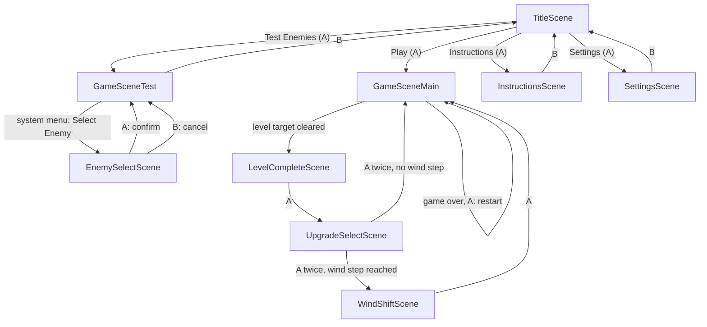

# Scenes

One page per `NobleScene` subclass in this folder: what it's for, how you get
there, what it does with the buttons, and where it sends you next. Keep this
file in sync when you add, remove, or rewire a scene — see the note in the
repo's top-level `CLAUDE.md`.

All scenes are reached via `Noble.transition(SomeScene, ..., sceneProperties)`
(Noble Engine, `source/libraries/noble/Noble.lua`). `sceneProperties` is the
table passed to the new scene's `:init()` — each section below lists what
keys a scene reads out of it, if any.

## Flow diagram

Functional coverage of every edge in this diagram (driven by simulated
button-down events, not the real Simulator) lives in
[`tests/test_scene_flow.lua`](../../tests/test_scene_flow.lua) — see that
file's header and `tests/support/mock_game_scene.lua` for what's real vs.
stubbed.

## TitleScene

Start screen — the game's entry point (`main.lua` calls
`Noble.new(TitleScene, ...)`). Renders a 4-item menu with
[playout](../libraries/playout.lua).

- **Reached from:** app launch only.
- **Controls:** Up/Down move the highlight (wraps); A confirms.
- **Menu items → transitions:**
  - "Play" → `GameSceneMain`
  - "Test Enemies" → `GameSceneTest`
  - "Instructions" → `InstructionsScene`
  - "Settings" → `SettingsScene`
- **sceneProperties read:** none.

## GameSceneMain

The real game. Enemies spawn automatically on a shrinking timer, capped per
level (`Config.LEVEL_ENEMY_STEP` enemies per level N). Clearing a level's
kill target hands off to `LevelCompleteScene`; every wind-escalation step
(`Config.LEVEL_WIND_STEP_INTERVAL` levels) routes the *next* level through
`WindShiftScene` first instead of coming straight back here (see
`GameSceneMain.windStepForLevel`).

- **Reached from:** `TitleScene` ("Play", no properties — starts at level 1),
  `UpgradeSelectScene` or `WindShiftScene` (continuing a run).
- **Controls:** crank steers, Up/Down trim sail, Left/Right charge+release a
  broadside (shared with `GameSceneTest` via `GameScene.buildSharedInputHandler`).
  A restarts the run *from level 1* once `gameOver` is true — otherwise A does
  nothing (this isn't a pause/resume, it's a full restart).
- **sceneProperties read:** `level` (default 1), `totalDefeated` (default 0,
  becomes `self.score`).
- **Transitions out:**
  - Level's kill target reached → `Noble.transition(LevelCompleteScene, ..., { completedLevel, totalDefeated })`
  - `gameOver` and A pressed → `Noble.transition(GameSceneMain)` (fresh run)

## GameSceneTest

A sandbox for testing ship/wind/combat feel: no automatic spawning or level
progression. Adds a "Select Enemy" item to the system menu while active (see
the 3-item system-menu cap note in the repo's `CLAUDE.md` before adding
another system-menu item anywhere).

- **Reached from:** `TitleScene` ("Test Enemies"), `EnemySelectScene` (after
  confirming or cancelling a pick).
- **Controls:** shared steer/trim/charge bindings (see `GameSceneMain` above);
  A spawns one enemy (`GameSceneTest.selectedEnemyType`, or random if unset);
  B returns to `TitleScene`.
- **sceneProperties read:** none.
- **Transitions out:**
  - B → `Noble.transition(TitleScene)`
  - System menu "Select Enemy" → `Noble.transition(EnemySelectScene)`
- **Notable state:** `GameSceneTest.selectedEnemyType` is a *class-level*
  field (not per-instance), so it survives this scene being torn down and
  recreated — that's how `EnemySelectScene`'s pick sticks across a
  transition back into a brand-new `GameSceneTest` instance.

## EnemySelectScene

Reached only from `GameSceneTest`'s system-menu item. Lists every entry in
`GameScene.enemyTypes` so you can force a specific type instead of a random
one.

- **Reached from:** `GameSceneTest` (system menu "Select Enemy").
- **Controls:** Up/Down move the highlight (wraps, defaults to whatever
  `GameSceneTest.selectedEnemyType` currently is); A confirms and returns; B
  cancels and returns without changing the selection.
- **sceneProperties read:** none (reads `GameSceneTest.selectedEnemyType`
  directly).
- **Transitions out:** A or B → `Noble.transition(GameSceneTest)` (A also
  sets `GameSceneTest.selectedEnemyType` first).

## InstructionsScene

Static how-to-play text.

- **Reached from:** `TitleScene` ("Instructions").
- **Controls:** B returns to `TitleScene`.
- **sceneProperties read:** none.

## SettingsScene

Toggles the `Config.HUD_SHOW_*` flags (Wind Speed / Wind Direction / Player
Speed) — moved here (out of the system menu) so the system menu stays free
for scene-specific items like `GameSceneTest`'s "Select Enemy"; see the
3-item cap note in `CLAUDE.md`. Built with
[playout](../libraries/playout.lua).

- **Reached from:** `TitleScene` ("Settings").
- **Controls:** Up/Down move the highlight (wraps); A toggles the
  highlighted setting; B returns to `TitleScene`.
- **sceneProperties read:** none.

## LevelCompleteScene

Interstitial shown after clearing a level: reports the running defeated
total, then hands off to `UpgradeSelectScene` to pick a run upgrade before
continuing.

- **Reached from:** `GameSceneMain` (level target cleared).
- **Controls:** A continues.
- **sceneProperties read:** `completedLevel` (default 1), `totalDefeated`
  (default 0).
- **Transitions out:** A → `Noble.transition(UpgradeSelectScene, ..., { level = completedLevel + 1, completedLevel, totalDefeated })`.

## UpgradeSelectScene

Offers 3 randomly-drawn entries from `Config.UPGRADES`
(`source/scripts/ConfigUpgrades.lua`), rendered with
[playout](../libraries/playout.lua). Two phases: `"select"` (pick one) then
`"result"` (before/after readout), each its own screen behind the same A
button. Carries the level/wind-step handoff the rest of the way — decides
whether the run continues straight into `GameSceneMain` or detours through
`WindShiftScene` first.

- **Reached from:** `LevelCompleteScene`.
- **Controls:** Up/Down move the highlight (`"select"` phase only); A
  applies the highlighted upgrade (via `Config.applyUpgrade`) and swaps to
  the result screen; a second A continues on.
- **sceneProperties read:** `level` (default 1), `completedLevel` (default
  `level - 1`), `totalDefeated` (default 0).
- **Transitions out (second A press, from `"result"` phase):**
  - `GameSceneMain.windStepForLevel(level) > GameSceneMain.windStepForLevel(completedLevel)`
    → `Noble.transition(WindShiftScene, ..., { level, totalDefeated })`
  - otherwise → `Noble.transition(GameSceneMain, ..., { level, totalDefeated })`

## WindShiftScene

Interstitial warning shown only on levels where clearing also lands a wind
escalation step (see `GameSceneMain.windStepForLevel`) — other levels skip
straight from `UpgradeSelectScene` to `GameSceneMain`.

- **Reached from:** `UpgradeSelectScene` (wind-step levels only).
- **Controls:** A continues.
- **sceneProperties read:** `level` (default 1), `totalDefeated` (default 0).
- **Transitions out:** A → `Noble.transition(GameSceneMain, ..., { level, totalDefeated })`.
